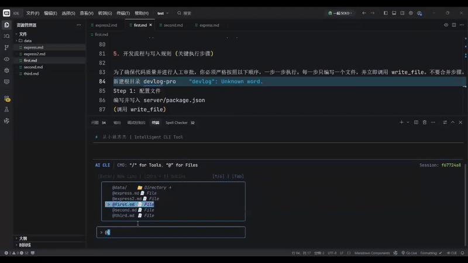
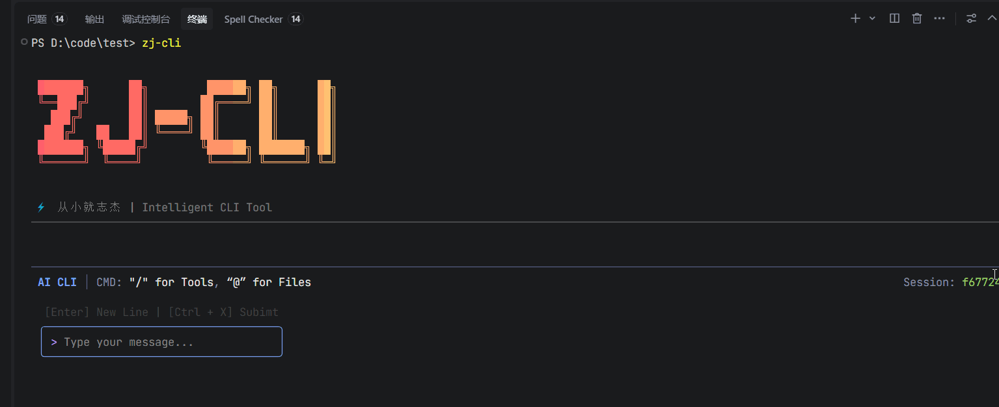

# 🤖 AI-Agent CLI: 智能全链路开发助手

> 基于 **LangGraph** + **React Ink** 构建的终端智能编程 Agent。
>
> _“不仅是对话，更是执行。从需求拆解到代码落地，全流程接管。”_

<!-- 徽章区域：展示技术栈 -->

[](https://www.typescriptlang.org/)
[](https://github.com/vadimdemedes/ink)
[](https://langchain-ai.github.io/langgraphjs/)
[](https://nodejs.org/)
[](LICENSE)

---

## ✨ 核心演示 (Demo)



_上图展示了 Agent 从接收自然语言指令“根据文档开发项目”，到自动规划、生成代码、写入文件的完整过程。_

---



_上图展示了 Agent 切换对话的完整过程。_

---

## 📖 项目介绍

**AI-Agent CLI** 是一个运行在终端（Terminal）中的智能编程助手。

与传统的 Chatbot 不同，它具备**Agentic Workflow（智能体工作流）**能力。它不只是生成文本，更能**操作文件系统**、**执行 Shell 命令**并**自我修正**。

项目解决了传统 AI 编程工具无法处理复杂多步骤任务的痛点，通过 **DAG（有向无环图）** 架构管理状态，实现了从“需求分析”到“代码交付”的自动化闭环。

### 核心能力

- 🧠 **双阶段规划 (Two-Stage Planning)**: 自动将模糊需求拆解为 `Project Plan` 和具体的 `Todo List`。
- 🖥️ **交互式终端 UI**: 使用 **React Ink** 构建，支持流式输出、打字机效果、结构化日志展示，告别枯燥的命令行。
- 🛡️ **安全审批 (Human-in-the-loop)**: 敏感操作（如 `write_file`, `exec_command`）内置拦截机制，需人工 `Approve` 才能执行。
- 💾 **状态持久化**: 基于文件系统的分层存储架构，支持**断点续传**。即使进程退出，也能恢复之前的开发上下文。
- ✅ **结构化输出**: 集成 **Zod** 进行严格的数据校验，确保 AI 输出的指令和代码格式 100% 可用。

---

## 🏗️ 核心架构

### 整体设计

```
┌─────────────────────────────────────────────────────┐
│                   用户输入                           │
└───────────────┬─────────────────────────────────────┘
                │
                ▼
    ┌───────────────────────┐
    │   initialize 节点     │  ← 处理文件引用 + 扫描项目树
    └───────┬───────────────┘
            │
            ▼
    ┌───────────────────────┐
    │   classifier 节点     │  ← 意图分类：任务 vs 闲聊
    └───┬───────────────┬───┘
        │               │
   [任务模式]        [闲聊模式]
        │               │
        ▼               ▼
┌───────────────┐  ┌──────────┐
│  planner 节点 │  │ chat 节点│ → END（友好回复）
└───────┬───────┘  └──────────┘
        │
        ▼
┌───────────────────────┐
│   executor 节点       │  ← 核心执行引擎
│ ┌─────────────────┐  │     • 调用 AI 模型
│ │  AI 模型决策    │  │     • 工具调用
│ └────┬───────┬────┘  │     • 任务推进
└──────┼───────┼────────┘     • 循环检测
       │       │
   [工具调用] [任务完成]
       │       │
       ▼       ▼
┌──────────┐  END
│ tools 节点│
└─────┬─────┘
      │
      ▼
  [敏感工具？]
      │
 ┌────┴────┐
 │         │
[是]      [否]
 │         │
 ▼         ▼
review   直接执行
节点      │
 │        │
 └────┬───┘
      │
      ▼
   executor
   （继续循环）
```

### 技术栈详情

| 维度     | 技术选型                   | 说明                            |
| -------- | -------------------------- | ------------------------------- |
| 语言     | TypeScript                 | 全类型安全开发                  |
| AI 编排  | LangChain.js / LangGraph   | 实现有向无环图 (DAG) 工作流     |
| UI 渲染  | Ink (React for CLI)        | 在终端中使用 React 组件和 Hooks |
| 数据校验 | Zod                        | 保证 LLM 结构化输出的稳定性     |
| 运行时   | Node.js                    | 文件系统操作、进程管理          |
| 模型支持 | OpenAI / DeepSeek / Doubao | 兼容多种 OpenAI 格式接口的模型  |

---

## 🚀 快速开始

### 1. 环境要求

- Node.js >= 18.0.0
- 一个可用的 LLM API Key (如 OpenAI, DeepSeek, 豆包等)

### 2. 安装

#### 克隆项目

```bash
git clone https://github.com/lei-lee11/bytedance-project.git
```

#### 进入目录

```bash
cd AI-Agent
```

#### 安装依赖

```bash
npm install
```

### 3. 配置

复制环境变量模版文件：

```bash
cp .env.example .env
```

编辑 `.env` 文件，填入你的 API Key：

```
ARK_API_KEY=your_api_key_here
ARK_MODEL=doubao-seed-1-6-thing-250715
```

### 4. 启动

#### 开发模式

```bash
npm run start
```

#### 或者编译后运行

```bash
npm run build && npm run prod
```

---

## 📂 目录结构

```
src/
├── agent/ # 🤖 智能体核心
│   ├── graph.ts # LangGraph 图定义
│   ├── nodes.ts # 节点逻辑 (Planner, Executor...)
│   └── prompts.ts # Prompt 工程
├── cli.tsx # 🖥️ Ink UI 入口
├── ui/ # React 组件 (InputArea, LogViewer...)
├── tools/ # 🔧 工具链 (FileOps, Shell...)
├── storage/ # 💾 持久化存储层
└── config/ # ⚙️ 配置文件
```

---

## 🤝 贡献与联系

李金朋 (Jinpeng Li)

- 📧 Email: 1637295803@qq.com
- 💻 Github: https://github.com/lei-lee11

如果你觉得这个项目有趣，欢迎给一个 ⭐️ Star！
